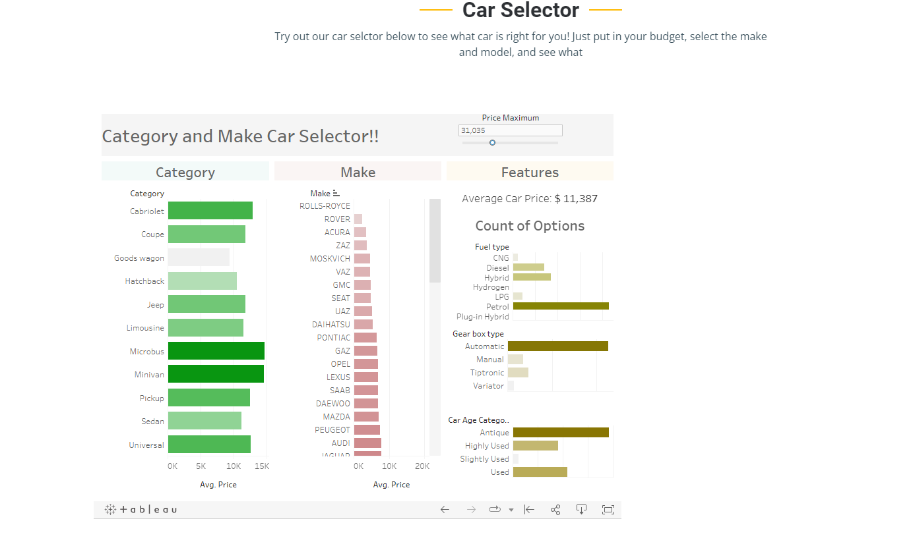
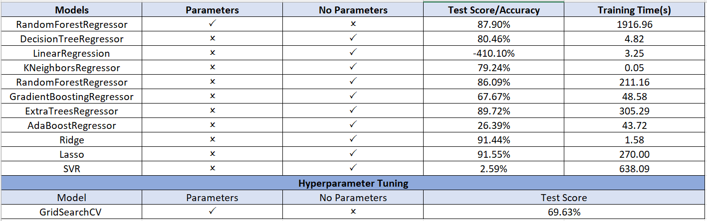

# Keeping-it-Wheel

## Group Members:
* Ashley M
* Maheen A
* Hassan M
* Colleen K
* Diana L
* Elena O
* Vertta M
* Vinika P

## Overview
Buying a car for the first time can be a stressful experience, especially if you’re a recent college graduate. We have a client who has just graduated college and is looking for a new car to commute to his new job. We have been hired to predict car prices to help our client make the best economical decision on his car purchase. We will be performing Supervised Machine Learning Algorithms to our Datasets. We will fit the model, train and predict the model using supervised algorithms. We will be using Jupyter notebook, python, pandas for cleaning and SQL database as our data retrieval source in our ETL process.

## Limitations 
Due to the size of the dataset and limiting memory inside jupyter notebook and google colab, we were not able to use all the records to run our model. the highest number of records that we were able to use was 30,000. We took 30,000 random samples from our dataset to run our supervised machine learning regression models.

## Data ETL
* We were able to extract a car price dataset from amazonaws.com. [car data](https://aws.amazon.com/marketplace/pp/prodview-y77x3t6zisn4w?sr=0-2&ref_=beagle&applicationId=AWSMPContessa#dataSets) is the dataset that we've used. It comprises of 44365 rows and 13 columns.

* We cleaned and transformed the data by loading it to PostgreSql Database and retrieved the required data from postgresql database for our machine learning algorithms.

* We used 30,000 random samples from our dataset to run the models. We were not able to use all the records due to the memory limitations inside jupyter notebook and as well as google colab. 

* Google colab gave us results with less number of sample records. Therefore, we used jupyter notebook as it was able to give us results with 30,000 records.

## Cleaned Data:

* After the data was cleaned, we split the data into x and y values. 
* Our X had the following columns : year, make, model, miles, trim and y is: sold_price
* We used get_dummies to have all numerical values for our x data. 
* After converting the X data, we end up with 30,000 rows and 2143 columns.  
* We split the data into x_train,x_test, y_train and y_test and used standard scaler to standardize the data. 

## Supervised Machine Learning Models 

After the satandardizing the data, we made our dataset run through multiple models. Models Used :
* RandomForestTreesRegressor --> took almost 1 hour to run with parameters. 
* RandomForestTreesREgressor (without parameters)
* DecisionTressRegressor
* Linear Regression
* KNeighborsRegressor
* GradientBoostingRegressor
* ExtraTreesRegressor
* AdaBoostRegressor
* Ridge
* Lasso
* SVR

## Our Website 

We were able to deploy our tableau dashboard and regression models to our website. 

## Analysis and Conclusion

## Data Sources
* ["Money Under 30" Article](https://www.moneyunder30.com/how-much-car-can-you-afford)
* [AWS Marketplace - Carvana Car Sales for United States](https://aws.amazon.com/marketplace/pp/prodview-y77x3t6zisn4w?sr=0-2&ref_=beagle&applicationId=AWSMPContessa#offers)
* First image was taken from: [Car Image](https://plungedindebt.com/wp-content/uploads/2019/08/Leasing-A-Car.jpg)

